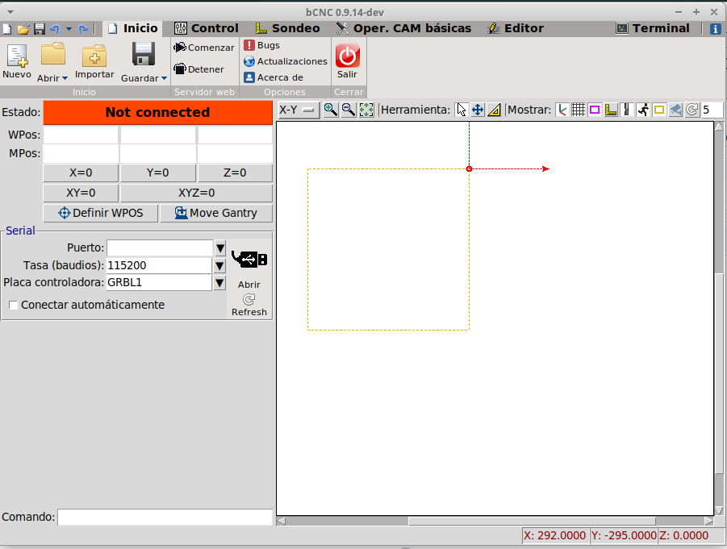

# Instalación de bCNC en Linux

bCNC es un programa desarrollado en python2.7 cuya función es controlar una máquina fresadora CNC. Los pasos para instalar el programa en Linux (prueba realizada en Xubuntu 18.04) son:

- Descargar y descomprimir el archivo bCNC-0.9.14.62.tar.gz
- Copiar la carpeta /bCNC-0.9.14.62 dentro de la carpeta /usr/lib/python2.7/
- Crear lanzador con orden /usr/lib/python2.7/bCNC-0.9.14.62/bCNC/bCNC

##Link 
- https://pypi.org/project/bCNC/
- https://github.com/vlachoudis/bCNC
